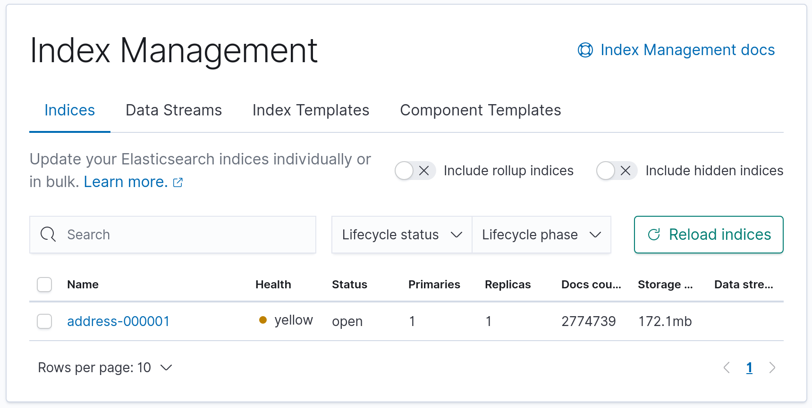

# address graphql project

Example search for addresses using Quarkus, Hibernate Search, GraphQL, ElasticSearch, Hibernate MassIndexer from PostgresSQL.

Run the Elastic and Kiabana pods locally
```bash
podman-compose up -d
```

Run the app
```aidl
mvn quarkus:dev
```

The Address format is from AUS GNAF Dataset 

- Kibana available on `localhost:5601`
- GraphQL UI available on `locahost:8080`


Data Set based on Australia - G-NAF - Geoscape Geocoded National Address File (G-NAF)
- https://data.gov.au/dataset/ds-dga-19432f89-dc3a-4ef3-b943-5326ef1dbecc/details?q=

`import.sql` - has 2500 records of test data.

## Test data

Bump up indexer for larger batches
```java
  searchSession.massIndexer()
    .batchSizeToLoadObjects(100000)
```

If using large `import.sql`, turn on transactions for whole of file, top and tail with
```bash
begin;
end;
```

Also tested against 3 million gnaf records without issue. Full set for Australia has 14m+ using `pg_dump` with binary file.


