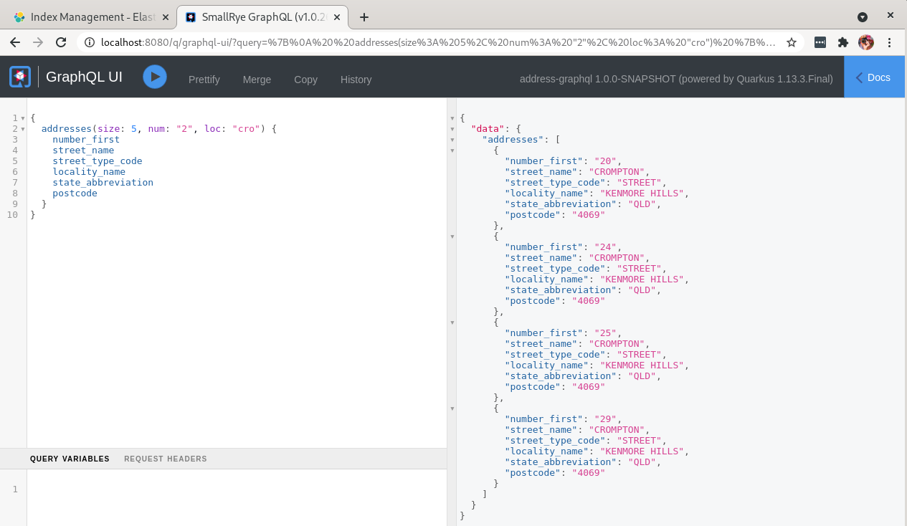

# address graphql project

Example search for addresses using Quarkus, Hibernate Search, GraphQL, ElasticSearch, Hibernate MassIndexer from PostgresSQL.

Run the Elastic and Kiabana pods locally
```bash
podman-compose up -d
```

Run the app
```aidl
mvn quarkus:dev
```

The Address format is from AUS GNAF Dataset 

- Kibana available on `localhost:5601`
- GraphQL UI available on `locahost:8080`


